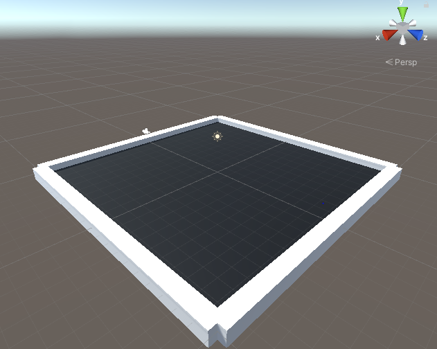
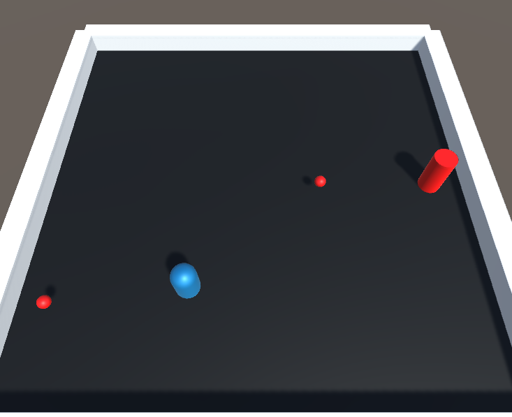
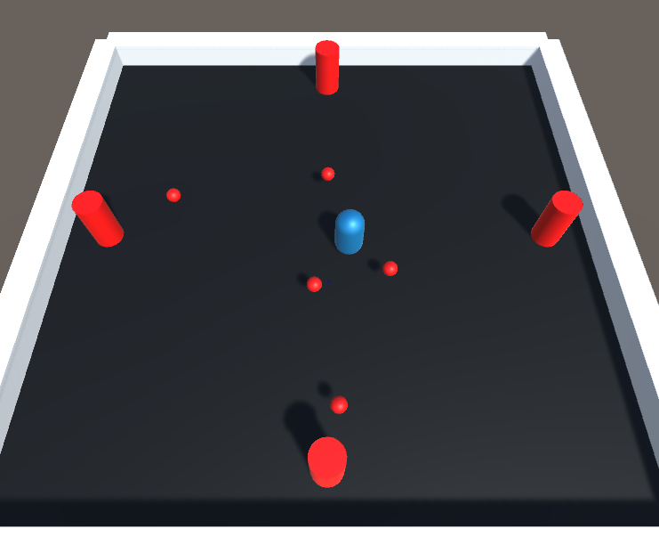
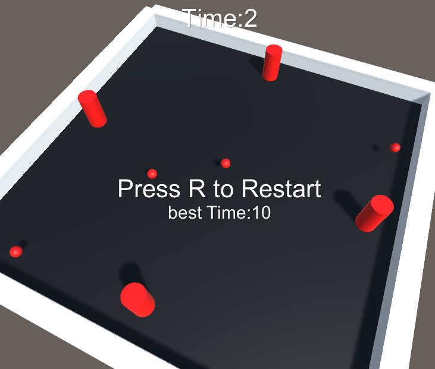
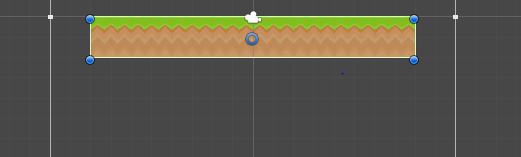
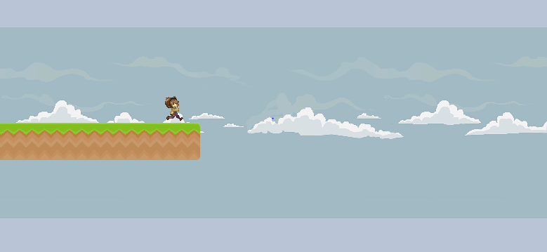

# Unity
 
# First_Game(Bullet Avoid)

## Step 1.

게임이 실행되는 땅(Plane)과 행동 범위를 만들기 위해 cube를 이용하여 틀은 만든다.


* 실제 유니티 화면입니다

여기서 게임 범위와 틀의 크기는 임의로 크기를 정하여 설정하였습니다.

Plane 만들기

1. Hierarchy창에서 3d create에서 Plane을 만든다.
2. Project창에서 Material을 만든 후 색상을 변경한다.
3. Project창에 있는 Plane 색상에 해당하는 Material을 plane에 드래그한다.
4. Hierarchy창에서 Plane을 클릭한 후 Inspector창에서 사이즈와 위치를 설정한다.

황동 범위를 위한 Cube 만들기

1. Hierarchy창에서 3d create에서 Cube를 만든다.(벽의 색상은 기본인 흰색으로 통일하였다)
2. Hierarchy창에서 Cube를 클릭한 후 Inspector창에서 Cube의 크기와 위치를 설정하여 조정한다.

* Hierarchy창에서 객체들을 정리하기 위해 빈 파일을 만든 후 모든 Cube와 Plane을 넣어두었다.

## step 2.

해당 게임의 메인 플레이어 만들기


Player 만들기
1. Hierarchy창에서 3d create에서 Capsure을 만든다.
2. 해당 Player의 크기를 설정한 후 색상을 설정한다.
3. 컴퓨터에서 Player을 인식할 수 있도록 Inspector창에서 Tag를 Player로 설정해 준다.
4. 해당 메인 플레이어는 총알을 피하면서 움직여야 하기 때문에 물리적인 힘을 받아야 한다 따라서 Inspector창에서 Add Component에서 Rigidbody를 추가해 준다, 또한 Player은 Capsure로 생성했기 때문에 넘어지지 않도록 Rigidbody창에 있는 Constraints 필드에서 움직임에 제한을 걸어준다.
5. Player가 물리적 움직임을 갖을수 있도록 코딩을 해서 드래그 해줍니다, 밑의 코딩은 Player코딩이고 처음에는 if문을 이용하여 하나하나 움직임을 설정했지만 버벅거림 현상이 보여 Horizontal, Vertical메서드를 이용하여 코딩했더니 부드러운 움직임을 볼수 있었다. 

```C#
using System.Collections;
using System.Collections.Generic;
using UnityEngine;

public class Player : MonoBehaviour
{
    public Rigidbody playerRigidbody; // 이동에 사용할 리지드바디 컴포넌트
    public float speed = 8f; //이동 속력
    void Start()
    {
        playerRigidbody = GetComponent<Rigidbody>();
        // Capsure에 설정한 Rigidbody 컴포넌트를 찾아 platerRigidbody에 할당한다.
    }

    void Update()
    {
        float xInput = Input.GetAxis("Horizontal");
        float zInput = Input.GetAxis("Vertical");
        // 수평 수직 움직임을 감지하여 저장한다

        float xSpeed = xInput * speed;
        float zSpeed = zInput * speed;

        Vector3 newVelocity = new Vector3(xSpeed, 0f, zSpeed);
        playerRigidbody.velocity = newVelocity;

    }

        public void Die()
        {
            gameObject.SetActive(false); //gameObject = Player 게임 오브젝트
        }
}
```


## step 3.

Player가 피해야할 탄알과 탄알을 발사체 만들기


* 해당 사진은 실제 게임을 작동시키는 도중의 사진입니다.


Bullet 만들기

1. Sphere을 만들어 주고 크기와 위치를 설정해 줍니다.
2. 적절한 색을 입혀줍니다.
3. Bullet 또한 물리적인 힘에 의해 날라가는 투사체이기 때문에 Inspector창에서 Rigidbody를 Add해줍니다.
4. Bullet은 Player을 잡아내는 역활을 하기 때문에 충격을 감지하기 위해 Inspector창에서 Is Trigger을 활성화 시켜 줍니다.
5. Bullet은 사진과 같이 한개가 아닌 여러개가 날라가고 또한 앞으로는 발사체를 더 만들기 때문에 개수가 많아집니다 한개한개 설정하기 힘들기 때문에 Bullet 프리팹을 만들어 한가지 설정을 저장하여 다른 Bullet또한 같은 설정이 될수 있도록 저장해 줍니다.
6. Hierarchy창에 있는 Bullet을 Project창으로 드래그 해주면 Project창에 Bullet 프리팹이 생성됩니다.
7. BUllet은 BulletSpawner에 의해 발사되어 Player을 죽이는 역할임을 생각하며 설계합니다.
8. BUllet의 움직임을 위해 BUllet에 해당하는 코딩을 해서 드래그 해줍니다.

```C#
using System.Collections; 
using System.Collections.Generic; 
using UnityEngine;

public class Bullet : MonoBehaviour
{
    public float speed = 8f; //탄알 이동 속력
    private Rigidbody bulletRigidbody; //이동에 사용할 리지드바디 컴포넌트

    void Start()
    {
        
        bulletRigidbody = GetComponent < Rigidbody() >;
            //게임 오브젝트에서 Rigidbody 컴포넌트를 찾아 bulletRigidbody에 할당
        bulletRigidbody.velocity = transform.forward * speed;
        //리지드바디의 속도 = 앞쪽 방향 * 이동속력

        Destroy(gameObject, 3f);
    }

    void OnTriggerEnter(Collider other)
    {
        if(other.tag == "Player")
        {
            PlayerController playerController = other.GetComponent<PlayerController>();
            // 상대방 게임 오브젝트에서 PlaterController 컴포넌트 가져오기

            if (playerController != null)
            {
                playerController.Die();
            }
        }
    }
}

```

BulletSpawner 만들기

1. Cylinder을 만들어 크기와 위치를 잡아주고 색상을 변경해 줍니다.
2. BulletSpawner가 하는일은 주기적으로 Bullet을 Player에게 발사하는 일을 생각하며 해당 스크립트를 설계합니다.

```C#
using System.Collections;
using System.Collections.Generic;
using UnityEngine;

public class BulletSpawner : MonoBehaviour
{
    public GameObject bulletPrefab; // 탄알의 원본 프리팹
    public float spawnRateMin = 0.5f; // 최초 탄알 생성 주기
    public float spawnRateMax = 3f; // 최대 생성 주기

    private Transform target; // 발사할 대상
    private float spawnRate; // 생성 주기
    private float timeAfterSpawn; // 최근 생성 시점에서 지난 시간

    void Start()
    {
        timeAfterSpawn = 0f; // 탄알을 하나 생성한 후 누적 시간을 0으로 초기화
        spawnRate = Random.Range(spawnRateMin, spawnRateMax); // 탄알 발사 주기를 spawnRateMin과 spawnRateMax사이의 랜던값으로 지정
        target = FindObjectOfType<PlayerController>().transform; // PlayerController컴포넌트를 가진 객체를 목표물로 설정
    }

    // Update is called once per frame
    void Update()
    {
        timeAfterSpawn += Time.deltaTime; // 컴퓨터마다 속도는 다르지만 Update를 실행할때 마다 그 사이의 시간 간격을 갱신시켜 줍니다.

        if (timeAfterSpawn >= spawnRate)
        // timeAfterSpawn(가장 최근 탄알을 생성한 누적시간)이 spawnRate(생성 주기)보다 크거나 같으면
        {
            timeAfterSpawn = 0f; // 누적시간을 리셋한다.
            GameObject bullet
                = Instantiate(bulletPrefab, transform.position, transform.rotation);
            // 원본 bullet을 복제한 bullet의 위치와 회전을 지정해 줍니다.
            bullet.transform.LookAt(target);
            // 타겟(Player)의 정면에서 bullet이 향하도록 정해줍니다.
            spawnRate = Random.Range(spawnRateMin, spawnRateMax);
            // 탄알 생성 주기를 spawnRateMin과 spawnRateMax사이의 랜던값으로 지정
        }
    }
}

```

BulletSpawner의 프리팹을 만들어 같은 성능의 BUlletSpawner을 3개더 만들어 줍니다.


## step 4.

게임 난이도 높이기.

총알만 피하기는 게임이 심심하다고 생각하여 난이도를 올리고 싶다는 생각이 들어 방법을 생각하던 도중 바닥을 회전시키는 방법과 발사체를 움직이는 방법을 생각해 보았습니다 우선 바닥을 회전시키는 코드를 짜보도록 하겠습니다.

```C#
using System.Collections;
using System.Collections.Generic;
using UnityEngine;

public class Rotator : MonoBehaviour
{
    public float rotationSpeed = 60f;
    // 1초 60도 회전 하도록 설정
    void Update()
    {
        transform.Rotate(0f, rotationSpeed, 0f);
    }
    // Rotate메서드를 활용하여 rotationSpeed를 할당하여 업데이트 되도록 설정합니다.
}
```

- 위 코드는 맨처음 생각하여 설계한 코드지만 실행해본 결과 Rotate를 Update메서드에 할당하여 1프레임에 60도가 회전하도록 설정되었습니다, 즉 컴퓨터 마다 1초당 몇 프레임이 돌아갈지는 다르기 때문에 각 컴퓨터마다 회전 속도가 달라지는 오류가 생겨 프레임의 시간 간격을 설정합니다.

```C#
using System.Collections;
using System.Collections.Generic;
using UnityEngine;

public class Rotator : MonoBehaviour
{
    public float rotationSpeed = 60f;

    void Update()
    {
        transform.Rotate(0f, rotationSpeed * Time.deltaTime, 0f);
    }
    // Time.deltaTime: 초당 프레임의 역수
}
```

Step 5.

게임 꾸미기

UI: 게임에서의 오브젝트가 아닌 별도의 오브젝트로 다른 공간에서 다루는 객체이지만 UI자체에서는 자신의 요소를 게임 오브젝트로 취급합니다.

생존시간 UI만들기.
1. 우선 UI는 2D로 작업하는것이 편하기 때문에 2D로 변경해 줍니다.
2. Hierarchy창에서 UI -> Text를 생성합니다.
3. Text를 Inspector창에서 편집합니다.
4. 편집에서는 Text의 위치, 폰트 크기, 텍스트 문자, 색을 설정할수 있습니다. 단, 폰트 크기를 설정하기 위해서는 수직 수평을 Overflow로 변경해줘야 폰트가 짤리지 않고 그대로 출력됩니다.

게임 재시작 텍스트 만들기.

1. 생존시간 텍스트를 만든것과 마찬가지로 UI파일에 텍스트를 하나 더 생성합니다.
2. 편집에서 Text의 위치, 폰트 크기, 텍스트 문자, 색을 설정할수 있습니다. 단, 폰트 크기를 설정하기 위해서는 수직 수평을 Overflow로 변경해줘야 폰트가 짤리지 않고 그대로 출력됩니다.

최고기록 텍스트 만들기.

1. 위와 같은 방법으로 텍스트를 하나 추가합니다.
2. 최고기록 텍스트는 게임 재시작 텍스트와 함께 출력되도록 게임 재시작 텍스트의 자식 파일로 설정합니다.
3. 편집에서 Text의 위치, 폰트 크기, 텍스트 문자, 색을 설정할수 있습니다. 단, 폰트 크기를 설정하기 위해서는 수직 수평을 Overflow로 변경해줘야 폰트가 짤리지 않고 그대로 출력됩니다.

이제 각 테스트들이 각각의 기능을 할 수 있도록 코딩해 줍니다.

```C#
using System.Collections;
using System.Collections.Generic;
using UnityEngine;
using UnityEngine.UI;
using UnityEngine.SceneManagement;

public class GameManager : MonoBehaviour
{
    public GameObject gameoverText; // 게임오버시 활성화할 텍스트(재시작 텍스트, 최고기록 텍스트)
    public Text timeText; // 생존 시간 표시하는 텍스트 컴포넌트
    public Text recordText; // 최고 기록 표시할 텍스트 컴포넌트

    private float surviveTime; // 생존 시간
    private bool isGameover; //게임오버 상태

    void Start()
    {
        surviveTime = 0;
        isGameover = false;
    }

    void Update()
    {
        if (!isGameover) // 생존하는 동안
        {
            surviveTime += Time.deltaTime; // 시간 갱신
            timeText.text = "Time:" + (int)surviveTime; // 생존 시간 timeText로 표시
        }
        else
        {
            if (Input.GetKeyDown(KeyCode.R))
            {
                SceneManager.LoadScene("SampleScene");
            /* using UnityEngine.SceneManagement에 속해 있는 내장씬 관리자 
            즉, SampleScene을 파괴하고 새로운 SampleScene을 가져오므로 게임을 재시작합니다. */
            }
        }        
        
    }

    public void EndGame()
    {
        isGameover = true;
        // 게임이 오버될 경우
        gameoverText.SetActive(true);
        // 게임오버 텍스트 활성화\
        float bestTime = PlayerPrefs.GetFloat("BestTime");
        // 이번 bestTime으로 저장된 기록 가져오기

        if(surviveTime > bestTime)
        {
            bestTime = surviveTime;
            PlayerPrefs.SetFloat("BestTime", bestTime);

        }
        recordText.text = "best Time:" + (int)bestTime;
    }
}
```
각각의 텍스트가 재 기능을 하는지 확인하고 Player스크립트로 넘어가 Die 메서드에 GameManager스크립트를 추가해 줍니다.

Gamemanager객체 만들기
1. Hierarchy창에서 빈 객체를 만들고 Gamemaneger스크립트를 드래그 해줍니다.
2. Gamemanager객체를 클릭한 후 Inspector창에서 각각의 기능에 해당하는 텍스트들을 설정해줍니다.
3. 밑 그림처럼 모든 텍스트들이 재 기능을 할수 있는것을 확인할수 있습니다.




----
----

# Second_Game(Tile Map)

* 이번 게임은 기존에 있던 오픈 소스의 이미지 파일들을 가져와 만들어 보았습니다.

Step1.

게임 Start_Line과 Dead_Line 만들기.

시작 발판 만들기

1. 가져온 오픈 소스에서 Platform_Long을 가져와 Hierarchy창으로 가져와 하나의 오브젝트로 만들었습니다.
2. 추후 Dead Line을 만들어야 하기때문에 적당한 Position을 설정합니다.
3. Platform_Long에 Box Collider 2D를 추가합니다.
- Box Collider 2D는 다른 Collider요소가 있는 객체와 충돌이 일어나도록 하는 컴포넌트입니다.


Dead Line 만들기

1. Dead Line의 기본 원리는 플레이어가 발판에 착지하지 못하고 땅에 떨어져서 충돌을 감지하면 죽는것을 기본 원리로 하였습니다.
2. Hierarchy창에서 빈 오브젝트를 생성하여 태그르 Dead로 바꿔줍니다.
3. 위치는 발판보다 낮지만 앞으로 더 밑에있는 발판을 만들수 있으므로 적당한 위치에 설정해줍니다.
4. Box Collider 2D 컴포넌트를 추가합니다
5. Box Collider 2D 컴포넌트속 Is Trigger을 체크하여 다른 오브젝트와의 충돌을 감지할수 있도록 설정합니다.
6. Dead Line의 길이는 모든 맴의 길이와 동일해야 하므로 최대한 길게 설정해주고 나중에 길이가 부족할 경우 늘려줍니다.
 

Step2.

Player 만들기.

1. 첫 화면에서 보이는 Player의 스크립트를 slice해서 Hierarchy창에 추가한 합니다.
2. Hierarchy창에 추가된 Player 오브젝트에 Rigidbody 컴포넌트를 추가하여 충돌을 감지합니다.
3. Circle Collider 2D컴포넌트를 추가하여 Player가 벽 모서리에 착지했을때 부드럽게 타고 올라가도록 추가해 줍니다.
4. Audio Source 컴포넌트를 추가하여 Player의 행동에 따라 배경 음악을 넣어줍니다.
5. Slice시킨 Player들을 animation에서 모두 참조하여 Player의 움직임을 만들어 줍니다.
6. animation창에서 Player의 움직임이 너무 빠른지 느린지를 생각하며 Samples를 조정해 줍니다. 
7. 같은 방법으로 Jump와 Die의 움직임을 조정하여 설정합니다.

- 유니티 2D에서는 Single 스프라이트가 여러개가 모여 Multiple 스프라이트로 합쳐져 구현합니다, 즉 하나의 Multiple 스프라이트를 여러개의 Single 스프라이트로 잘라서 사용할수도 있습니다.

Step3.

Player 상세 설정.

 1. Animator창은 해당 오브젝트의 Animation 컨트롤러의 상태도를 표시하는 창입니다.
 2. Animator창을 연 다음 Player의 Animation 컨트롤의 연관성을 설정해 줍니다.
 3. Animator설정은 연결할 Animation끼리 마우스로 드래그 해줍니다.
 4. 생성된 화살표를 클릭하면 해당 움직임을 하는 상태의 조건을 설정할 수 있습니다.
 5. Die는 Dead Line에 충돌이 있을 경우 죽기 때문에 Trigger로 설정해 줍니다.
 6. 이 게임에서 Player은 두번 점프할수 있으므로 Jump에 바닥에서 떨어져 있다는 상태를 표시하기 위해 Grounded에 False를 설정해줍니다.

  

  - 위 그림에서 Entry는 현재 상태가 진입하는 입구, Exit은 오브젝트 동작이 종료되는 출구, Any State는 현재상태에 상관없이 연결된 상태로 전이하게 허용하는 뜻입니다.


Step4.

Player 스크립트 설정.

```C#
using UnityEngine;

// PlayerController는 플레이어 캐릭터로서 Player 게임 오브젝트를 제어한다.
public class PlayerController : MonoBehaviour
{
    public AudioClip deathClip; // 사망시 재생할 오디오 클립
    public float jumpForce = 700f; // 점프 힘

    private int jumpCount = 0; // 누적 점프 횟수
    private bool isGrounded = false; // 바닥에 닿았는지 나타냄
    private bool isDead = false; // 사망 상태

    private Rigidbody2D playerRigidbody; // 사용할 리지드바디 컴포넌트
    private Animator animator; // 사용할 애니메이터 컴포넌트
    private AudioSource playerAudio; // 사용할 오디오 소스 컴포넌트

    private void Start()
    {
        // 초기화
        playerRigidbody = GetComponent<Rigidbody2D>();
        animator = GetComponent<Animator>();
        playerAudio = GetComponent<AudioSource>();
    }

    private void Update()
    {
        // 사용자 입력을 감지하고 점프하는 처리
        if (isDead)
        {
            return;
        }
        if (Input.GetMouseButtonDown(0) && jumpCount < 2)
        {
            jumpCount++;
            playerRigidbody.velocity = Vector2.zero;
            playerRigidbody.AddForce(new Vector2(0, jumpForce));
            playerAudio.Play();
        }
        else if (Input.GetMouseButtonUp(0) && playerRigidbody.velocity.y > 0)
        {
            playerRigidbody.velocity = playerRigidbody.velocity * 0.5f;
        }
        animator.SetBool("Grounded", isGrounded);
    }

    private void Die()
    {
        // 사망 처리
        animator.SetTrigger("Die");

        playerAudio.clip = deathClip;
        playerAudio.Play();
        playerRigidbody.velocity = Vector2.zero;
        isDead = true;
    }

    private void OnTriggerEnter2D(Collider2D other)
    {
        // 트리거 콜라이더를 가진 장애물과의 충돌을 감지
        if (other.tag == "Dead" && !isDead)
        {
            Die();
        }
    }

    private void OnCollisionEnter2D(Collision2D collision)
    {
        // 바닥에 닿았음을 감지하는 처리
        if (collision.contacts[0].normal.y > 0.7f)
        {
            isGrounded = true;
            jumpCount = 0;
        }
    }

    private void OnCollisionExit2D(Collision2D collision)
    {
        // 바닥에서 벗어났음을 감지하는 처리
        isGrounded = false;
    }
}

```

 - 해당 Player 스크립트는 위와 같으며 Hirerachy창에 있는 Player에 스크립트를 참조해 주고 해당 스크립트에 할당하는 오디오를 각각이 설정해 주면 Player 설정이 끝이 납니다.

Step5.

배경 설정하기

 - 미리 받아둔 Sky로 배경화면을 설정합니다.
 - Project창에 있는 Sky 스프라이트를 Hirerachy창으로 드래그하여 배경을 설정해줍니다.
 - Main camera에서 게임 배경화면이랑 어울리도록 그외 배경색을 설정해 줍니다.
 - 사진이 Player의 움직임에 따라 움직일수 있도록 스크립트를 추가해 줍니다.

```C#
using UnityEngine;

// 게임 오브젝트를 계속 왼쪽으로 움직이는 스크립트
public class ScrollingObject : MonoBehaviour {
    public float speed = 10f; // 이동 속도

    private void Update() {

        transform.Translate(Vector3.left * speed * Time.deltaTime);
        // 배경화면이 초당 speed의 속도로 왼쪽으로 평행이동
    }
}
```

이제 배경이 끊기지 않도록 스트립트를 Sky에 설정해 줍니다

```C#
using UnityEngine;

// 왼쪽 끝으로 이동한 배경을 오른쪽 끝으로 재배치하는 스크립트
public class BackgroundLoop : MonoBehaviour {
    private float width; // 배경의 가로 길이

    private void Awake() {
        BoxCollider2D backgroundCollider = GetComponent<BoxCollider2D>();
        width = backgroundCollider.size.x;
        // BoxCollider2D 컴포넌트의 Size x값을 가로 길이로 사용합니다.
    }

    private void Update() {
        // 현재 위치가 원점에서 왼쪽으로 width 이상 이동했을때 위치를 리셋
        if(transform.position.x <= -width)
        {
            Reposition();
        }
    }

    // 위치를 리셋하는 메서드
    private void Reposition() {
        Vector2 offset = new Vector2(width * 2f, 0);
        transform.position = (Vector2)transform.position + offset;
        // 현재 위치에서 오른쪽으로 가로 길이 *2 만큼 이동한다.
    }
}
```

스크립트를 Sky에 참조 해준 후, Sky오브젝트를 복사하여 위치를 첫 배경의 넓이만큼 오른쪽에 위치시킨 후 플레이해보면 배경이 끊기질 않는것을 볼 수 있습니다.

 


