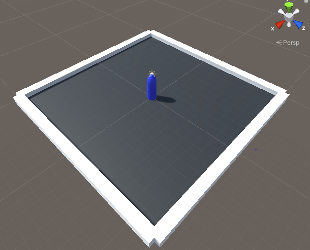

# Unity
 
# First_Game(Bullet Avoid)

## Step 1.

게임이 실행되는 땅(Plane)과 행동 범위를 만들기 위해 cube를 이용하여 틀은 만든다.


* 실제 유니티 화면입니다

여기서 게임 범위와 틀의 크기는 임의로 크기를 정하여 설정하였습니다.

Plane 만들기

1. Hierarchy창에서 3d create에서 Plane을 만든다.
2. Project창에서 Material을 만든 후 색상을 변경한다.
3. Project창에 있는 Plane 색상에 해당하는 Material을 plane에 드래그한다.
4. Hierarchy창에서 Plane을 클릭한 후 Inspector창에서 사이즈와 위치를 설정한다.

황동 범위를 위한 Cube 만들기

1. Hierarchy창에서 3d create에서 Cube를 만든다.(벽의 색상은 기본인 흰색으로 통일하였다)
2. Hierarchy창에서 Cube를 클릭한 후 Inspector창에서 Cube의 크기와 위치를 설정하여 조정한다.

* Hierarchy창에서 객체들을 정리하기 위해 빈 파일을 만든 후 모든 Cube와 Plane을 넣어두었다.

## step 2.

해당 게임의 메인 플레이어 만들기



Player 만들기
1. Hierarchy창에서 3d create에서 Capsure을 만든다.
2. 해당 Player의 크기를 설정한 후 색상을 설정한다.
3. 컴퓨터에서 Player을 인식할 수 있도록 Inspector창에서 Tag를 Player로 설정해 준다.
4. 해당 메인 플레이어는 총알을 피하면서 움직여야 하기 때문에 물리적인 힘을 받아야 한다 따라서 Inspector창에서 Add Component에서 Rigidbody를 추가해 준다, 또한 Player은 Capsure로 생성했기 때문에 넘어지지 않도록 Rigidbody창에 있는 Constraints 필드에서 움직임에 제한을 걸어준다.
5. Player가 물리적 움직임을 갖을수 있도록 코딩을 해서 드래그 해줍니다, 밑의 코딩은 Player코딩이고 처음에는 if문을 이용하여 하나하나 움직임을 설정했지만 버벅거림 현상이 보여 Horizontal, Vertical메서드를 이용하여 코딩했더니 부드러운 움직임을 볼수 있었다. 

```C#
using System.Collections;
using System.Collections.Generic;
using UnityEngine;

public class Player : MonoBehaviour
{
    public Rigidbody playerRigidbody; // 이동에 사용할 리지드바디 컴포넌트
    public float speed = 8f; //이동 속력
    void Start()
    {
        playerRigidbody = GetComponent<Rigidbody>();
        // Capsure에 설정한 Rigidbody 컴포넌트를 찾아 platerRigidbody에 할당한다.
    }

    void Update()
    {
        float xInput = Input.GetAxis("Horizontal");
        float zInput = Input.GetAxis("Vertical");
        // 수평 수직 움직임을 감지하여 저장한다

        float xSpeed = xInput * speed;
        float zSpeed = zInput * speed;

        Vector3 newVelocity = new Vector3(xSpeed, 0f, zSpeed);
        playerRigidbody.velocity = newVelocity;

    }

        public void Die()
        {
            gameObject.SetActive(false); //gameObject = Player 게임 오브젝트
        }
}
```


## step 3.

Player가 피해야할 탄알과 탄알을 발사체 만들기


* 해당 사진은 실제 게임을 작동시키는 도중의 사진입니다.


Bullet 만들기

1. Sphere을 만들어 주고 크기와 위치를 설정해 줍니다.
2. 적절한 색을 입혀줍니다.
3. Bullet 또한 물리적인 힘에 의해 날라가는 투사체이기 때문에 Inspector창에서 Rigidbody를 Add해줍니다.
4. Bullet은 Player을 잡아내는 역활을 하기 때문에 충격을 감지하기 위해 Inspector창에서 Is Trigger을 활성화 시켜 줍니다.
5. Bullet은 사진과 같이 한개가 아닌 여러개가 날라가고 또한 앞으로는 발사체를 더 만들기 때문에 개수가 많아집니다 한개한개 설정하기 힘들기 때문에 Bullet 프리팹을 만들어 한가지 설정을 저장하여 다른 Bullet또한 같은 설정이 될수 있도록 저장해 줍니다.
6. Hierarchy창에 있는 Bullet을 Project창으로 드래그 해주면 Project창에 Bullet 프리팹이 생성됩니다.
7. BUllet의 움직임을 위해 BUllet에 해당하는 코딩을 해서 드래그 해줍니다.

```C#
using System.Collections;
using System.Collections.Generic;
using UnityEngine;

public class Bullet : MonoBehaviour
{
    public float speed = 8f; //탄알 이동 속력
    private Rigidbody bulletRigidbody; //이동에 사용할 리지드바디 컴포넌트

    void Start()
    {
        
        bulletRigidbody = GetComponent < Rigidbody() >;
            //게임 오브젝트에서 Rigidbody 컴포넌트를 찾아 bulletRigidbody에 할당
        bulletRigidbody.velocity = transform.forward * speed;
        //리지드바디의 속도 = 앞쪽 방향 * 이동속력

        Destroy(gameObject, 3f);
    }

    void OntriggerEnter(Collider other)
    {
        if(other.tag == "Player")
        {
            PlayerController playerController = other.GetComponent<PlayerController>();
            // 상대방 게임 오브젝트에서 PlaterController 컴포넌트 가져오기

            if (playerController != null)
            {
                playerController.Die();
            }
        }
    }
}

```


